# Jarkom-Modul-3-C07-2021

Kelompok C07

|      NRP       |                  Nama                   |
| :------------: | :-------------------------------------: |
| 05111940000046 |       Titian Pamungkas Anjasmara        |
| 05111940000134 |           Ahmad Lamaul Farid            |
| 05111940000150 | Jonathan Leonardo Hasiholan Simanjuntak |

## Soal 1

```

```

### Jawaban

## Soal 2

```

```

### Jawaban

## Soal 3

```

```

### Jawaban

## Soal 4

```

```

### Jawaban

## Soal 5

```

```

### Jawaban

## Soal 6

```

```

### Jawaban

## Soal 7

```
Luffy dan Zoro berencana menjadikan Skypie sebagai server untuk jual beli kapal yang dimilikinya dengan alamat IP yang tetap dengan IP [prefix IP].3.69
```

### Jawaban

**Jipangu**

- Edit file `/etc/dhcp/dhcpd.conf` seperti pada gambar berikut:

  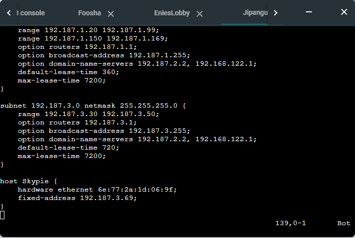

- Perhatikan pada baris hardware ethernet. Nilai `hardware ethernet tersebut merupakan nilai MAC address dari interface eth0 milik Skypie`. Cara mendapatkannya, masukkan perintah `ip a` pada node Skypie, dan salin IP Mac eth0 yang ditunjukkan. Untuk lebih jelasnya, perhatikan gambar berikut.

  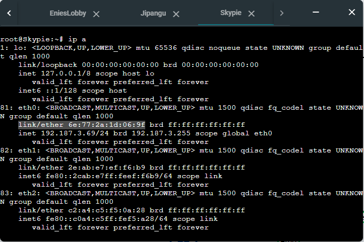

- Restart service isc-dhcp-server pada Jipangu dengan perintah :

  ```
    service isc-dhcp-server restart
  ```

**Skypie**

- Edit file `/etc/network/interfaces` seperti pada gambar berikut:

  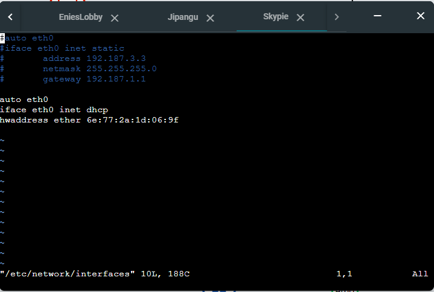

  _Nilai hwaddress menyesuaikan dengan MAC Address milik node Skypie_

- Restart node Skypie. Maka, IP address node Skypie akan menjadi fixed IP address, sesuai dengan nilai yang telah ditetapkan.

  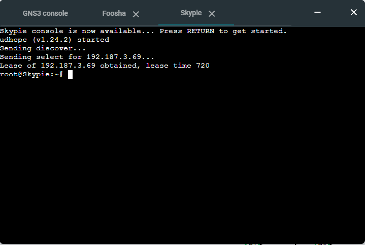

## Soal 8

```
Pada Loguetown, proxy harus bisa diakses dengan nama jualbelikapal.yyy.com dengan port yang digunakan adalah 5000
```

### Jawaban

**EniesLobby**

- Update library dari ubuntu dengan perintah `apt-get update`.

- Install `bind9` dengan memasukkan perintah `apt-get install bind9 -y`.

- Edit file `/etc/bind/named.conf.local` seperti pada gambar berikut :

  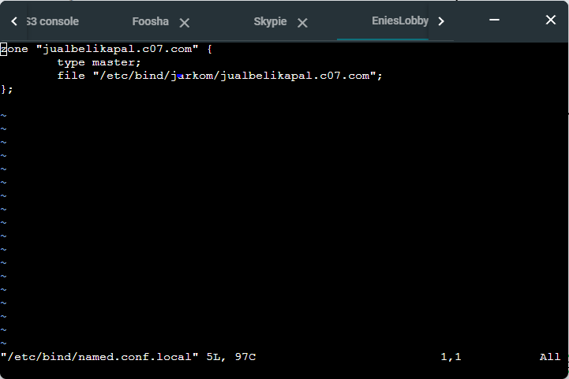

- Buat folder `jarkom` di direktori `/etc/bind/` dengan perintah :

  ```
  mkdir /etc/bind/jarkom
  ```

- Ketikkan `cp /etc/bind/db.local /etc/bind/jarkom/jualbelikapal.c07.com` untuk meng-copy file dari `db.local` menjadi `jualbelikapal.c07.com`.

- Edit file `/etc/bind/jarkom/jualbelikapal.c07.com` seperti pada gambar berikut :

  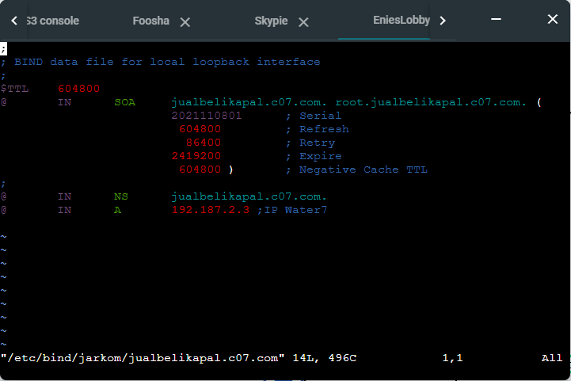

- Restart service bind9 dengan perintah :
  ```
  service bind9 restart
  ```

**Water7**

- Update library dari ubuntu dengan perintah `apt-get update`.

- Install `squid3` dengan memasukkan perintah `apt-get install squid -y`.

- Lakukan backup file `squid.conf` dengan merubah nama filenya menggunakan perintah :

  ```
  mv /etc/squid/squid.conf /etc/squid/squid.conf.bak
  ```

- Edit file `/etc/squid/squid.conf` seperti pada gambar berikut :

  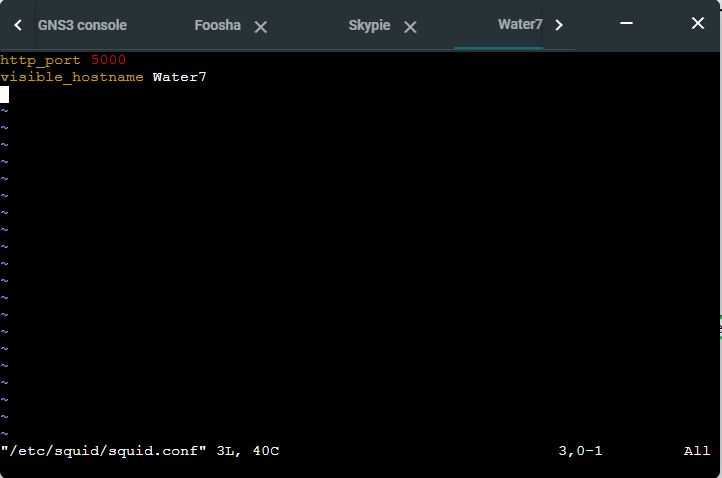

- Restart service squid3 dengan perintah :
  ```
  service squid restart
  ```

**Loguetown**

- Update library dari ubuntu dengan perintah `apt-get update`.

- Install `lynx` dengan memasukkan perintah `apt-get install lynx -y`.

- Aktifkan proxy pada node client Loguetown dengan menggunakan perintah :

  ```
  export http_proxy="http://jualbelikapal.c07.com:5000"
  ```

- Pastikan konfigurasi proxy sudah berhasil dengan memasukkan perintah :

  ```
  env | grep -i proxy
  ```

  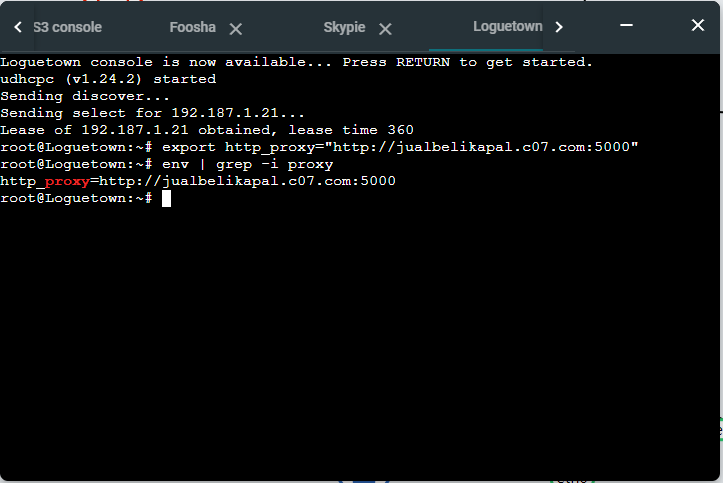

- Kemudian, buka alamat `google.com` dengan menggunakan perintah :

  ```
  lynx google.com
  ```

- Ketika berhasil dikunjungi, maka akan tampil seperti pada gambar berikut :

  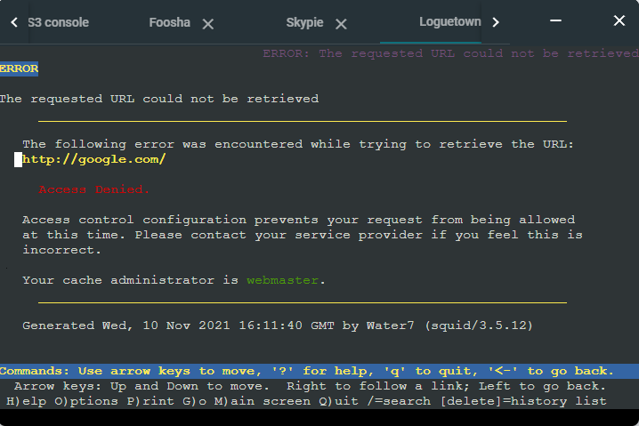

  _P.S : Konfigurasi pada server proxy Water7 masih di set untuk menolak semua akses HTTP (secara default)_

## Soal 9

```
 Agar transaksi jual beli lebih aman dan pengguna website ada dua orang, proxy dipasang autentikasi user proxy dengan enkripsi MD5 dengan dua username, yaitu luffybelikapalyyy dengan password luffy_yyy dan zorobelikapalyyy dengan password zoro_yyy
```

### Jawaban

**Water7**

- Update library dari ubuntu dengan perintah `apt-get update`.

- Install `apache2-utils` dengan memasukkan perintah `apt-get install apache2-utils -y`.

- Untuk membuat dua akun autentikasi user yang diminta, gunakan perintah :

  ```
  htpasswd -cbm /etc/squid/passwd luffybelikapalc07 luffy_c07
  htpasswd -bm /etc/squid/passwd zorobelikapalc07 zoro_c07
  ```

  Penjelasan :

  - c = create. Untuk membuat passwdfile tempat dua akun tersebut disimpan.
  - b = batch mode. Digunakan untuk memasukkan password lewat command line, sehingga tidak perlu ada menu prompt untuk input password.
  - m = MD5 encryption

- Edit file `/etc/squid/squid.conf` seperti pada gambar berikut :

  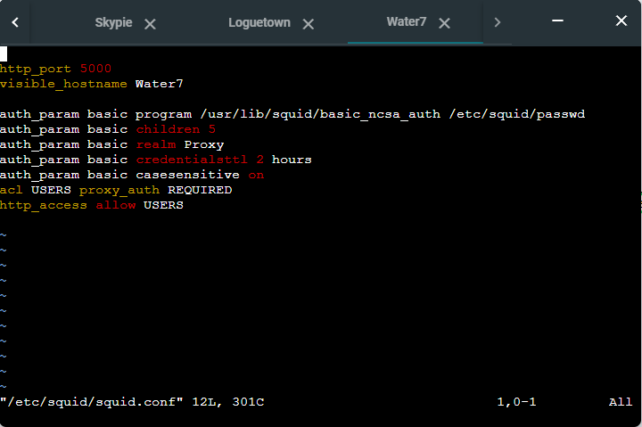

- Restart service squid3 dengan meggunakan perintah :

  ```
  service squid restart
  ```

**Loguetown**

- Pastikan node sudah terhubung menggunakan proxy dengan memasukkan perintah :

  ```
  env | grep -i proxy
  ```

  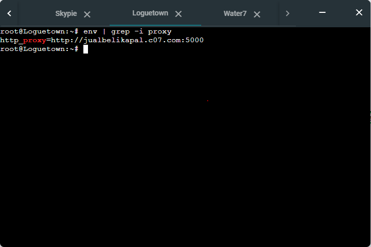

- Buka alamat `google.com` dengan menggunakan perintah :

```
lynx google.com
```

- Ketika tersambung, proxy akan melakukan autentikasi user terlebih dahulu. Masukkan username yang telah di konfigurasikan sebelumnya (contohnya luffybelikapalc07).

  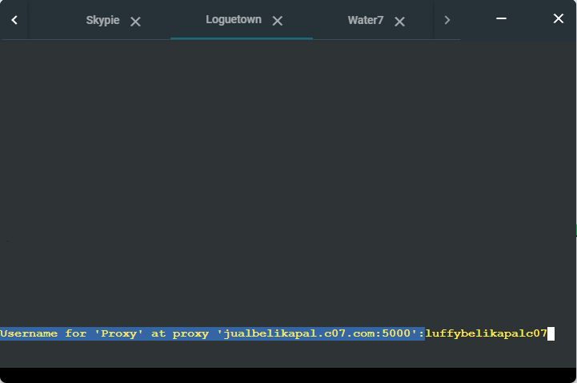

- Masukkan password username yang digunakan (contohnya luffy_c07)

  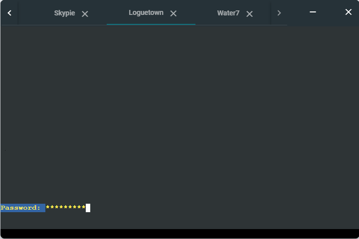

- Jika benar, maka akan terlihat halaman yang diminta sebelumnya (google.com)

  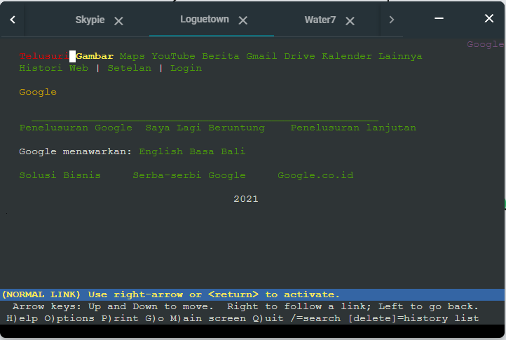

## Soal 10

```
Transaksi jual beli tidak dilakukan setiap hari, oleh karena itu akses internet dibatasi hanya dapat diakses setiap hari Senin-Kamis pukul 07.00-11.00 dan setiap hari Selasa-Jum’at pukul 17.00-03.00 keesokan harinya (sampai Sabtu pukul 03.00)
```

### Jawaban

**Water7**

- Buat file baru pada `/etc/squid/acl.conf`. Kemudian, edit file menjadi seperti gambar berikut :

  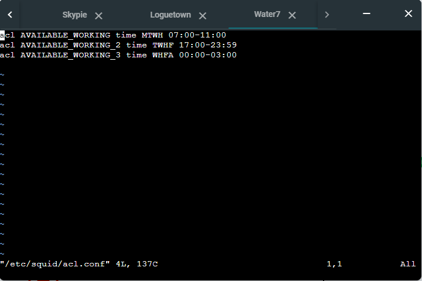

- Edit file `/etc/squid/squid.conf` menjadi seperti gambar berikut :

  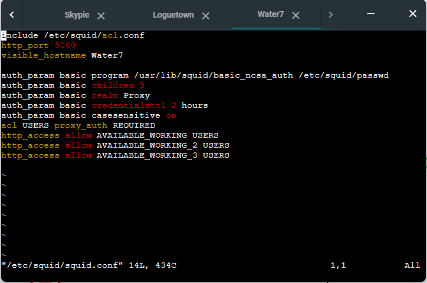

- Restart service squid3 dengan meggunakan perintah :

  ```
  service squid restart
  ```

**Loguetown**

- Lihat jam saat ini terlebih dahulu, gunakan perintah :

  ```
  date
  ```

  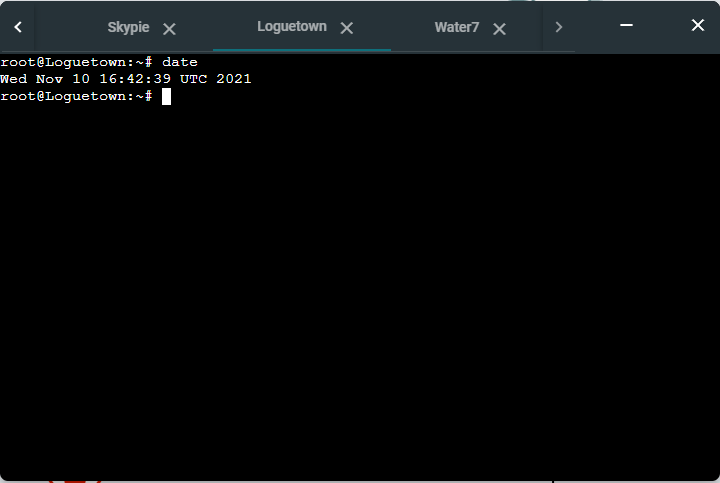

- Pastikan node sudah terhubung menggunakan proxy dengan memasukkan perintah :

  ```
  env | grep -i proxy
  ```

  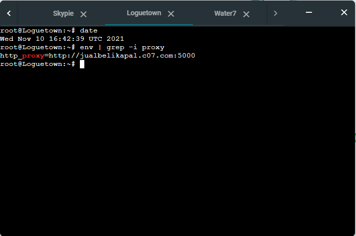

- Buka alamat `google.com` dengan menggunakan perintah :

  ```
  lynx google.com
  ```

- Pada kasus ini, halaman website tidak bisa dibuka karena waktunya tidak sesuai dengan aturan yang sudah dibuat sebelumnya.

  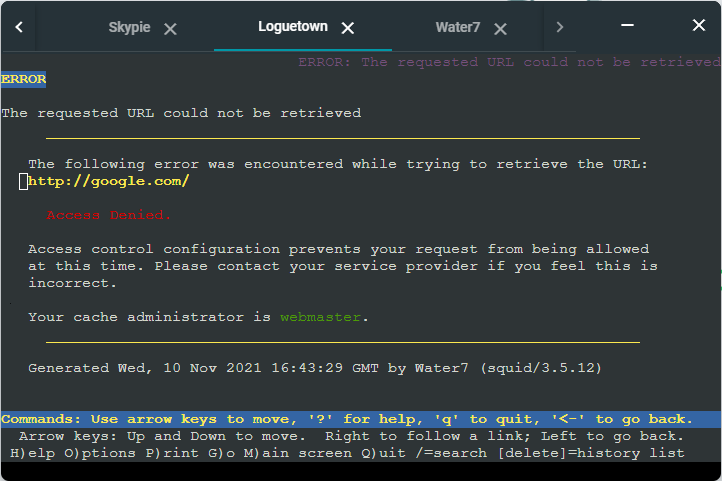

  **P.S : Proxy tidak meminta autentikasi user, sebab rule evaluationnya dimulai dengan membandingkan waktu saat ini dengan aturan yang ditetapkan**

- Untuk melihat apakah aturannya berjalan dengan baik, set waktu saat ini dengan perintah :

  ```
  date -s (waktu yang diinginkan)
  ```

  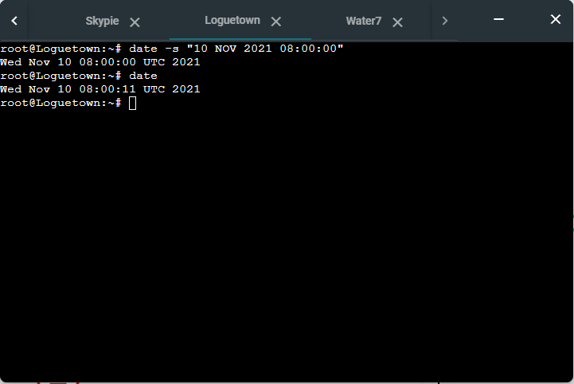

- Setelah waktunya sudah sesuai dengan aturan, akses kembali `google.com` dengan menggunakan perintah :

  ```
  lynx google.com
  ```

- Ketika tersambung, proxy akan melakukan autentikasi user terlebih dahulu.

  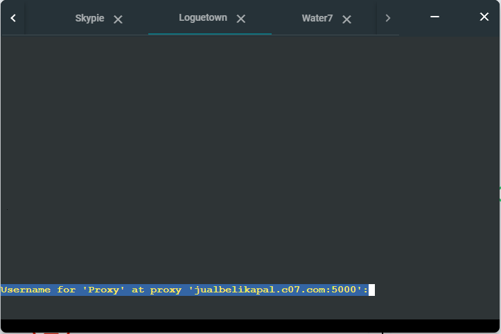

- Jika benar, maka akan terlihat halaman yang diminta sebelumnya (google.com)

  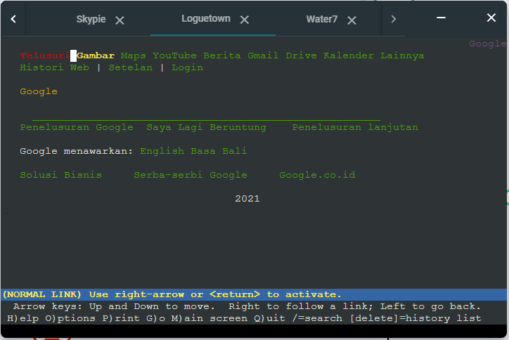

## Soal 11

```

```

### Jawaban

## Soal 12

```

```

### Jawaban

## Soal 13

```

```

### Jawaban
