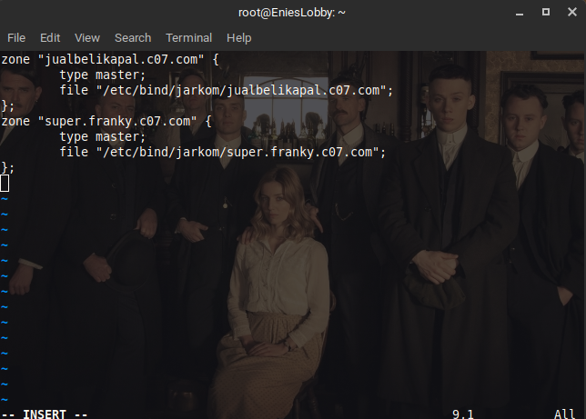
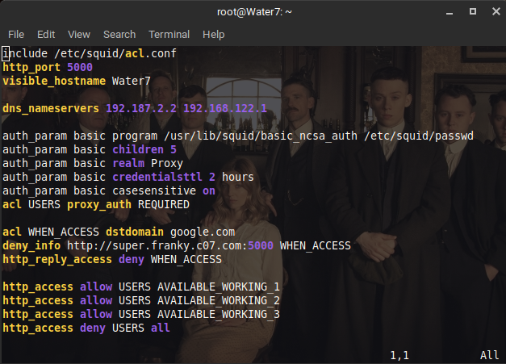
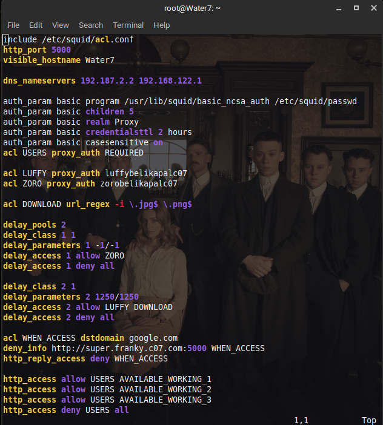
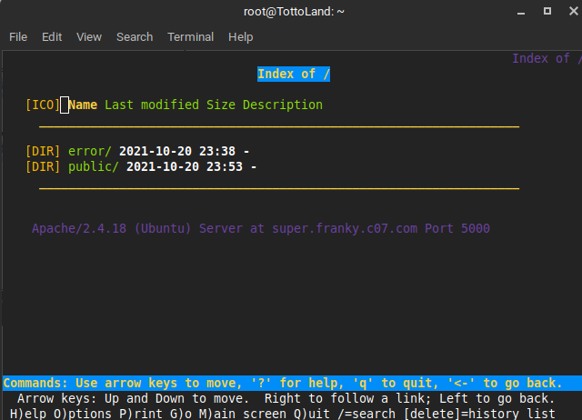

# Jarkom-Modul-3-C07-2021

Kelompok C07

|      NRP       |                  Nama                   |
| :------------: | :-------------------------------------: |
| 05111940000046 |       Titian Pamungkas Anjasmara        |
| 05111940000134 |           Ahmad Lamaul Farid            |
| 05111940000150 | Jonathan Leonardo Hasiholan Simanjuntak |

## Soal 1

```
Luffy bersama Zoro berencana membuat peta tersebut dengan kriteria EniesLobby sebagai DNS Server, Jipangu sebagai DHCP Server, Water7 sebagai Proxy Server
```

### Jawaban

**Config**

Kita perlu mengkonfigurasi node foosha dan node pada switch 2, agar dapat melakukan penginstalan package


**EniesLobby**

- Lakukan Penginstalan bind9 dengan menggunakan `apt-get update` dan `apt-get install bind9 -y`

**Jipangu**

- Lakukan Penginstalan dhcp server dengan menggunakan `apt-get update` dan `apt-get install isc-dhcp-server -y`

**Water7**

- Lakukan Penginstalan proxy dengan menggunakan `apt-get update` dan `apt-get install squid -y`

## Soal 2

```
Foosha sebagai DHCP Relay
```

### Jawaban

**Foosha**

- Lakukan Penginstalan DHCP relay dengan menggunakan `apt-get update` dan `apt-get install isc-dhcp-relay -y`

- Buka file `/etc/default/isc-dhcp-relay`, kemudian ubah isinya menjadi sebagai berikut. Server mengarah ke IP jipangu (DHCP server) dan ethernet 1, 2, dan 3.


## Soal 3

```
Client yang melalui Switch1 mendapatkan range IP dari [prefix IP].1.20 - [prefix IP].1.99 dan [prefix IP].1.150 - [prefix IP].1.169
```

### Jawaban

**Config client**

- Lakukan config pada semua client terlebih dahulu (Loguetown, Alabasta, Tottoland, Skypie) dengan konfigurasi sebagai berikut.


**Jipangu**

- Buka `/etc/default/isc-dhcp-server`, dan ubah interface menjadi eth0


- Buka `/etc/dhcp/dhcpd.conf`, dan tambahkan `range 192.187.1.20 192.187.1.99` dan `range 192.187.1.150 192.188.1.169`.


## Soal 4

```
Client yang melalui Switch3 mendapatkan range IP dari [prefix IP].3.30 - [prefix IP].3.50
```

### Jawaban

**Jipangu**

- Buka `/etc/dhcp/dhcpd.conf`, dan tambahkan `range 192.187.3.30 192.187.3.50`.


## Soal 5

```
Client mendapatkan DNS dari EniesLobby dan client dapat terhubung dengan internet melalui DNS tersebut.
```

### Jawaban

**Jipangu**

- Ubah option domain nameserver pada masing-masing subnet dengan penambahan IP EniesLobby.


## Soal 6

```
Lama waktu DHCP server meminjamkan alamat IP kepada Client yang melalui Switch1 selama 6 menit sedangkan pada client yang melalui Switch3 selama 12 menit. Dengan waktu maksimal yang dialokasikan untuk peminjaman alamat IP selama 120 menit.
```

### Jawaban

**Jipangu**

- Ubah max lease time pada kedua subnet menjadi 7200, sedangkan default lease time pada subnet 1 yaitu 360 dan default lease time pada subnet 3 yaitu 720


## Pengecekan kriteria


## Soal 7

```
Luffy dan Zoro berencana menjadikan Skypie sebagai server untuk jual beli kapal yang dimilikinya dengan alamat IP yang tetap dengan IP [prefix IP].3.69
```

### Jawaban

**Jipangu**

-   Edit file `/etc/dhcp/dhcpd.conf` seperti pada gambar berikut:

    

-   Perhatikan pada baris hardware ethernet. Nilai `hardware ethernet tersebut merupakan nilai MAC address dari interface eth0 milik Skypie`. Cara mendapatkannya, masukkan perintah `ip a` pada node Skypie, dan salin IP Mac eth0 yang ditunjukkan. Untuk lebih jelasnya, perhatikan gambar berikut.

    

-   Restart service isc-dhcp-server pada Jipangu dengan perintah :

    ```
      service isc-dhcp-server restart
    ```

**Skypie**

-   Edit file `/etc/network/interfaces` seperti pada gambar berikut:

    

    _Nilai hwaddress menyesuaikan dengan MAC Address milik node Skypie_

-   Restart node Skypie. Maka, IP address node Skypie akan menjadi fixed IP address, sesuai dengan nilai yang telah ditetapkan.

    

## Soal 8

```
Pada Loguetown, proxy harus bisa diakses dengan nama jualbelikapal.yyy.com dengan port yang digunakan adalah 5000
```

### Jawaban

**EniesLobby**

-   Update library dari ubuntu dengan perintah `apt-get update`.

-   Install `bind9` dengan memasukkan perintah `apt-get install bind9 -y`.

-   Edit file `/etc/bind/named.conf.local` seperti pada gambar berikut :

    

-   Buat folder `jarkom` di direktori `/etc/bind/` dengan perintah :

    ```
    mkdir /etc/bind/jarkom
    ```

-   Ketikkan `cp /etc/bind/db.local /etc/bind/jarkom/jualbelikapal.c07.com` untuk meng-copy file dari `db.local` menjadi `jualbelikapal.c07.com`.

-   Edit file `/etc/bind/jarkom/jualbelikapal.c07.com` seperti pada gambar berikut :

    

-   Restart service bind9 dengan perintah :
    ```
    service bind9 restart
    ```

**Water7**

-   Update library dari ubuntu dengan perintah `apt-get update`.

-   Install `squid3` dengan memasukkan perintah `apt-get install squid -y`.

-   Lakukan backup file `squid.conf` dengan merubah nama filenya menggunakan perintah :

    ```
    mv /etc/squid/squid.conf /etc/squid/squid.conf.bak
    ```

-   Edit file `/etc/squid/squid.conf` seperti pada gambar berikut :

    

-   Restart service squid3 dengan perintah :
    ```
    service squid restart
    ```

**Loguetown**

-   Update library dari ubuntu dengan perintah `apt-get update`.

-   Install `lynx` dengan memasukkan perintah `apt-get install lynx -y`.

-   Aktifkan proxy pada node client Loguetown dengan menggunakan perintah :

    ```
    export http_proxy="http://jualbelikapal.c07.com:5000"
    ```

-   Pastikan konfigurasi proxy sudah berhasil dengan memasukkan perintah :

    ```
    env | grep -i proxy
    ```

    

-   Kemudian, buka alamat `google.com` dengan menggunakan perintah :

    ```
    lynx google.com
    ```

-   Ketika berhasil dikunjungi, maka akan tampil seperti pada gambar berikut :

    

    _P.S : Konfigurasi pada server proxy Water7 masih di set untuk menolak semua akses HTTP (secara default)_

## Soal 9

```
 Agar transaksi jual beli lebih aman dan pengguna website ada dua orang, proxy dipasang autentikasi user proxy dengan enkripsi MD5 dengan dua username, yaitu luffybelikapalyyy dengan password luffy_yyy dan zorobelikapalyyy dengan password zoro_yyy
```

### Jawaban

**Water7**

-   Update library dari ubuntu dengan perintah `apt-get update`.

-   Install `apache2-utils` dengan memasukkan perintah `apt-get install apache2-utils -y`.

-   Untuk membuat dua akun autentikasi user yang diminta, gunakan perintah :

    ```
    htpasswd -cbm /etc/squid/passwd luffybelikapalc07 luffy_c07
    htpasswd -bm /etc/squid/passwd zorobelikapalc07 zoro_c07
    ```

    Penjelasan :

    -   c = create. Untuk membuat passwdfile tempat dua akun tersebut disimpan.
    -   b = batch mode. Digunakan untuk memasukkan password lewat command line, sehingga tidak perlu ada menu prompt untuk input password.
    -   m = MD5 encryption

-   Edit file `/etc/squid/squid.conf` seperti pada gambar berikut :

    

-   Restart service squid3 dengan meggunakan perintah :

    ```
    service squid restart
    ```

**Loguetown**

-   Pastikan node sudah terhubung menggunakan proxy dengan memasukkan perintah :

    ```
    env | grep -i proxy
    ```

    

-   Buka alamat `google.com` dengan menggunakan perintah :

```
lynx google.com
```

-   Ketika tersambung, proxy akan melakukan autentikasi user terlebih dahulu. Masukkan username yang telah di konfigurasikan sebelumnya (contohnya luffybelikapalc07).

    

-   Masukkan password username yang digunakan (contohnya luffy_c07)

    

-   Jika benar, maka akan terlihat halaman yang diminta sebelumnya (google.com)

    

## Soal 10

```
Transaksi jual beli tidak dilakukan setiap hari, oleh karena itu akses internet dibatasi hanya dapat diakses setiap hari Senin-Kamis pukul 07.00-11.00 dan setiap hari Selasa-Jum’at pukul 17.00-03.00 keesokan harinya (sampai Sabtu pukul 03.00)
```

### Jawaban

**Water7**

-   Buat file baru pada `/etc/squid/acl.conf`. Kemudian, edit file menjadi seperti gambar berikut :

    

-   Edit file `/etc/squid/squid.conf` menjadi seperti gambar berikut :

    

-   Restart service squid3 dengan meggunakan perintah :

    ```
    service squid restart
    ```

**Loguetown**

-   Lihat jam saat ini terlebih dahulu, gunakan perintah :

    ```
    date
    ```

    

-   Pastikan node sudah terhubung menggunakan proxy dengan memasukkan perintah :

    ```
    env | grep -i proxy
    ```

    

-   Buka alamat `google.com` dengan menggunakan perintah :

    ```
    lynx google.com
    ```

-   Pada kasus ini, halaman website tidak bisa dibuka karena waktunya tidak sesuai dengan aturan yang sudah dibuat sebelumnya.

    

    _P.S : Proxy tidak meminta autentikasi user, sebab rule evaluationnya dimulai dengan membandingkan waktu saat ini dengan aturan yang ditetapkan_

-   Untuk melihat apakah aturannya berjalan dengan baik, set waktu saat ini dengan perintah :

    ```
    date -s (waktu yang diinginkan)
    ```

    

-   Setelah waktunya sudah sesuai dengan aturan, akses kembali `google.com` dengan menggunakan perintah :

    ```
    lynx google.com
    ```

-   Ketika tersambung, proxy akan melakukan autentikasi user terlebih dahulu.

    

-   Jika benar, maka akan terlihat halaman yang diminta sebelumnya (google.com)

    

## Soal 11

```
Agar transaksi bisa lebih fokus berjalan, maka dilakukan redirect website agar mudah mengingat website transaksi jual beli kapal. Setiap mengakses google.com, akan diredirect menuju super.franky.yyy.com dengan website yang sama pada soal shift modul 2. Web server super.franky.yyy.com berada pada node Skypie
```

### Jawaban

**Skypie**

-   Pertama - tama, update library dari ubuntu dengan perintah `apt-get update`.

-   Install `apache2 dan librarynya` dengan memasukkan perintah `apt-get install apache2 -y` dan `apt-get install libapache2-mod-php7.0 -y`.

-   Jalankan apache yang telah dipasang dengan memasukkan perintah `service apache2 start`.

-   Install `php` dengan memasukkan perintah `apt-get install php -y`.

-   Install tools `wget` dengan memasukkan perintah `apt-get install wget -y`.

-   Install tools `unzip` dengan memasukkan perintah `apt-get install unzip -y`.

-   Setelah semua tools sudah berhasil dipasang, download terlebih dahulu file library web yang telah disediakan dengan perintah :

    ```
    wget https://raw.githubusercontent.com/FeinardSlim/Praktikum-Modul-2-Jarkom/main/super.franky.zip
    ```

-   Copy konfigurasi 000-default web server yang akan digunakan sebagai template konfigurasi web server super.franky.c07.com dengan perintah :

    ```
    cp /etc/apache2/sites-available/000-default.conf /etc/apache2/sites-available/super.franky.c07.com.conf
    ```

-   Edit file `/etc/apache2/sites-available/super.franky.c07.com.conf` seperti pada gambar berikut :

    

-   Jalankan konfigurasi website yang telah dibuat dengan menjalankan perintah :

    ```
    cd /etc/apache2/sites-available/
    a2ensite super.franky.c07.com.conf
    ```

-   Kemudian unzip file yang telah didownload dan letakkan pada directory `/var/www/`. Setelah itu rename file menjadi `super.franky.c07.com` dengan command berikut :

    ```
    unzip super.franky.zip -d /var/www/
    mv /var/www/super.franky /var/www/super.franky.c07.com
    ```

-   Edit file `/etc/apache2/ports.conf` seperti pada gambar berikut :

    

-   Restart service apache dengan perintah :

    ```
    service apache2 restart
    ```

**EniesLobby**

-   Edit file `/etc/bind/named.conf.local` dan tambahkan config berikut :

    ```
    zone "super.franky.c07.com" {
        type master;
        file "/etc/bind/jarkom/super.franky.c07.com";
    };
    ```

    

-   Edit file `/etc/bind/jarkom/super.franky.c07.com` seperti pada gambar berikut:

    

-   Restart bind9 dengan perintah

    ```
    service bind9 restart
    ```

**Water7**

-   Edit file `/etc/squid/squid.conf` dan tambahkan config berikut :

    ```
    dns_nameservers 192.187.2.2 192.168.122.1

    acl WHEN_ACCESS dstdomain google.com
    deny_info http://super.franky.c07.com:5000 WHEN_ACCESS
    http_reply_access deny WHEN_ACCESS
    ```

    

-   Restart service squid dengan perintah :

    ```
    service squid restart
    ```

**Loguetown**

-   Pastikan node sudah terhubung menggunakan proxy dengan memasukkan perintah :

    ```
    env | grep -i proxy
    ```

-   Kemudian buka alamat `google.com` dengan menggunakan perintah :

    ```
    lynx google.com
    ```

-   Masukkan username dan password yang telah diatur pada soal sebelumnya, seperti pada gambar berikut :

    

    

-   Jika username dan password valid, maka setiap kali kita mengakses URL `google.com` maka kita akan secara otomatis dialihkan ke `super.franky.c07.com` seperti pada gambar berikut :

    

## Soal 12

```
Saatnya berlayar! Luffy dan Zoro akhirnya memutuskan untuk berlayar untuk mencari harta karun di super.franky.yyy.com. Tugas pencarian dibagi menjadi dua misi, Luffy bertugas untuk mendapatkan gambar (.png, .jpg), sedangkan Zoro mencari sisanya. Karena Luffy orangnya sangat teliti untuk mencari harta karun, ketika ia berhasil mendapatkan gambar, ia mendapatkan gambar dan melihatnya dengan kecepatan 10 kbps
```

### Jawaban

**Water7**

-   Edit file `/etc/squid/squid.conf` dan tambahkan config berikut :

    ```
    acl LUFFY proxy_auth luffybelikapalc07
    acl ZORO proxy_auth zorobelikapalc07

    acl DOWNLOAD url_regex -i \.jpg$ \.png$

    delay_pools 2
    delay_class 1 1
    delay_parameters 1 -1/-1
    delay_access 1 allow ZORO
    delay_access 1 deny all

    delay_class 2 1
    delay_parameters 2 1250/1250
    delay_access 2 allow LUFFY DOWNLOAD
    delay_access 2 deny all
    ```

    

    _P.S : Config diatas bertujuan untuk membatasi bandwidth setiap user, dimana pada soal diminta agas `user luffy` dapat mendownload file (`.png` dan `.jpg`) dengan kecepatan `10 kbps` sedangkan `user zoro` tidak memiliki batas kecepatan (`unlimited`)_

-   Restart service squid3 dengan meggunakan perintah :

    ```
    service squid restart
    ```

**Loguetown - sebagai user luffy**

-   Pastikan node sudah terhubung menggunakan proxy dengan memasukkan perintah :

    ```
    env | grep -i proxy
    ```

-   Kemudian buka alamat `google.com` dengan menggunakan perintah :

    ```
    lynx google.com
    ```

-   Masukkan username dan password untuk user luffy, seperti pada gambar berikut :

    

    

-   Jika username dan password valid, maka akan dialihkan ke `super.franky.c07.com` seperti pada gambar berikut :

    

-   Lakukan download untuk salah satu file `.png` atau `.jpg` seperti pada gambar berikut dan lihat kecepatan downloadnya :

    

    

    

    _P.S : Kecepatan download untuk user luffy telah dibatasi yaitu `10 kbps` dan dapat dilihat dari gambar diatas_

## Soal 13

```
Sedangkan, Zoro yang sangat bersemangat untuk mencari harta karun, sehingga kecepatan kapal Zoro tidak dibatasi ketika sudah mendapatkan harta yang diinginkannya
```

### Jawaban

**Water7**

-   Edit file `/etc/squid/squid.conf` dengan menambahkan config berikut :

    ```
    acl LUFFY proxy_auth luffybelikapalc07
    acl ZORO proxy_auth zorobelikapalc07

    acl DOWNLOAD url_regex -i \.jpg$ \.png$

    delay_pools 2
    delay_class 1 1
    delay_parameters 1 -1/-1
    delay_access 1 allow ZORO
    delay_access 1 deny all

    delay_class 2 1
    delay_parameters 2 1250/1250
    delay_access 2 allow LUFFY DOWNLOAD
    delay_access 2 deny all
    ```

    

    _P.S : Config diatas bertujuan untuk membatasi bandwidth setiap user, dimana pada soal diminta agas `user luffy` dapat mendownload file (`.png` dan `.jpg`) dengan kecepatan `10 kbps` sedangkan `user zoro` tidak memiliki batas kecepatan (`unlimited`)_

-   Restart service squid3 dengan meggunakan perintah :

    ```
    service squid restart
    ```

**TottoLand - sebagai user zoro**

-   Pastikan node sudah terhubung menggunakan proxy dengan memasukkan perintah :

    ```
    env | grep -i proxy
    ```

-   Kemudian buka alamat `google.com` dengan menggunakan perintah :

    ```
    lynx google.com
    ```

-   Masukkan username dan password untuk user zoro, seperti pada gambar berikut :

    

    

-   Jika username dan password valid, maka akan dialihkan ke `super.franky.c07.com` seperti pada gambar berikut :

    

-   Lakukan download untuk salah satu file `.png` atau `.jpg` seperti pada gambar berikut dan lihat kecepatan downloadnya :

    

    

    _P.S : Kecepatan download untuk user zoro tidak dibatasi atau `unlimited` sehingga ia tidak menampilkan kecepatan dowloadnya_
